## Table of Contents
1. [API Request Flow](#api-request-flow)
2. [Security Layer](#security-layer)
3. [Authentication Methods](#authentication-methods)
4. [Authorization Models](#authorization-models)
5. [RESTful API Design](#restful-api-design)
6. [Best Practices Checklist](#best-practices-checklist)

---

## API Request Flow

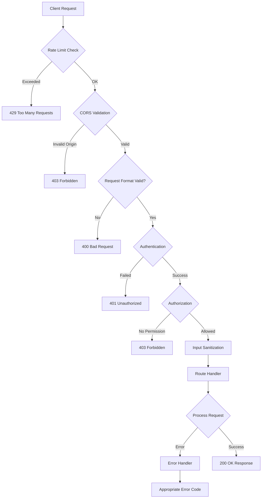

### Request Processing Pipeline

The API processes every request through multiple security layers in this specific order:

1. **Rate Limiting** - Controls request frequency
2. **CORS Check** - Validates origin domain
3. **Format Validation** - Ensures valid request structure
4. **Authentication** - Verifies user identity
5. **Authorization** - Checks user permissions
6. **Input Sanitization** - Prevents malicious code
7. **Business Logic** - Processes the actual request

---

## Security Layer

### Rate Limiting Strategy

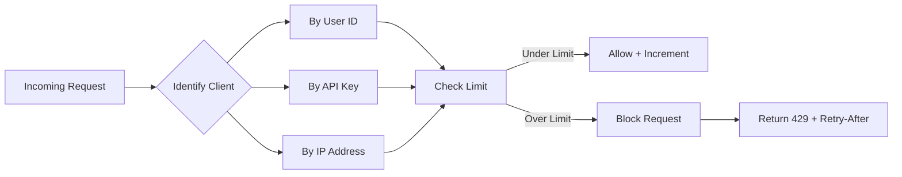

**Rate Limit Configuration Examples:**

<table>
  <thead>
    <tr>
      <th>Endpoint</th>
      <th>Limit</th>
      <th>Window</th>
      <th>Reason</th>
    </tr>
  </thead>
  <tbody>
    <tr>
      <td>`/auth/login`</td>
      <td>5 req</td>
      <td>1 min</td>
      <td>Prevent brute force</td>
    </tr>
    <tr>
      <td>`/products`</td>
      <td>100 req</td>
      <td>1 min</td>
      <td>General API usage</td>
    </tr>
    <tr>
      <td>`/orders`</td>
      <td>50 req</td>
      <td>1 min</td>
      <td>Write operations</td>
    </tr>
    <tr>
      <td>`/upload`</td>
      <td>10 req</td>
      <td>1 hour</td>
      <td>Resource-intensive</td>
    </tr>
  </tbody>
</table>

**Multi-Level Rate Limiting:**
- **Per-User**: Authenticated users get higher limits
- **Per-IP**: Anonymous users limited by IP address
- **Per-Endpoint**: Different endpoints have different limits
- **Global**: Overall system protection from DDoS

---

### Security Threats & Prevention

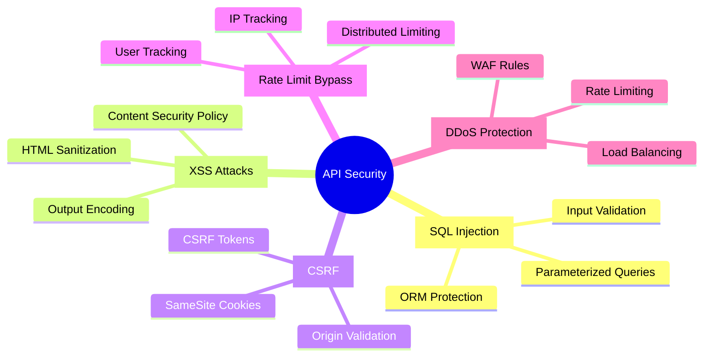

**Security Implementation Checklist:**

✅ **SQL Injection Prevention**
- Use parameterized queries/prepared statements
- Never concatenate user input into SQL
- Validate all input data types
- Use ORM frameworks when possible

✅ **XSS Prevention**
- Sanitize all HTML input
- Encode output data
- Set Content-Security-Policy headers
- Validate input against whitelist

✅ **CSRF Prevention**
- Generate unique CSRF tokens per session
- Validate token on state-changing requests
- Use SameSite cookie attribute
- Check Origin/Referer headers

✅ **DDoS Protection**
- Implement rate limiting at multiple levels
- Use Web Application Firewall (WAF)
- Deploy behind CDN/Load balancer
- Monitor traffic patterns

---

## Authentication Methods

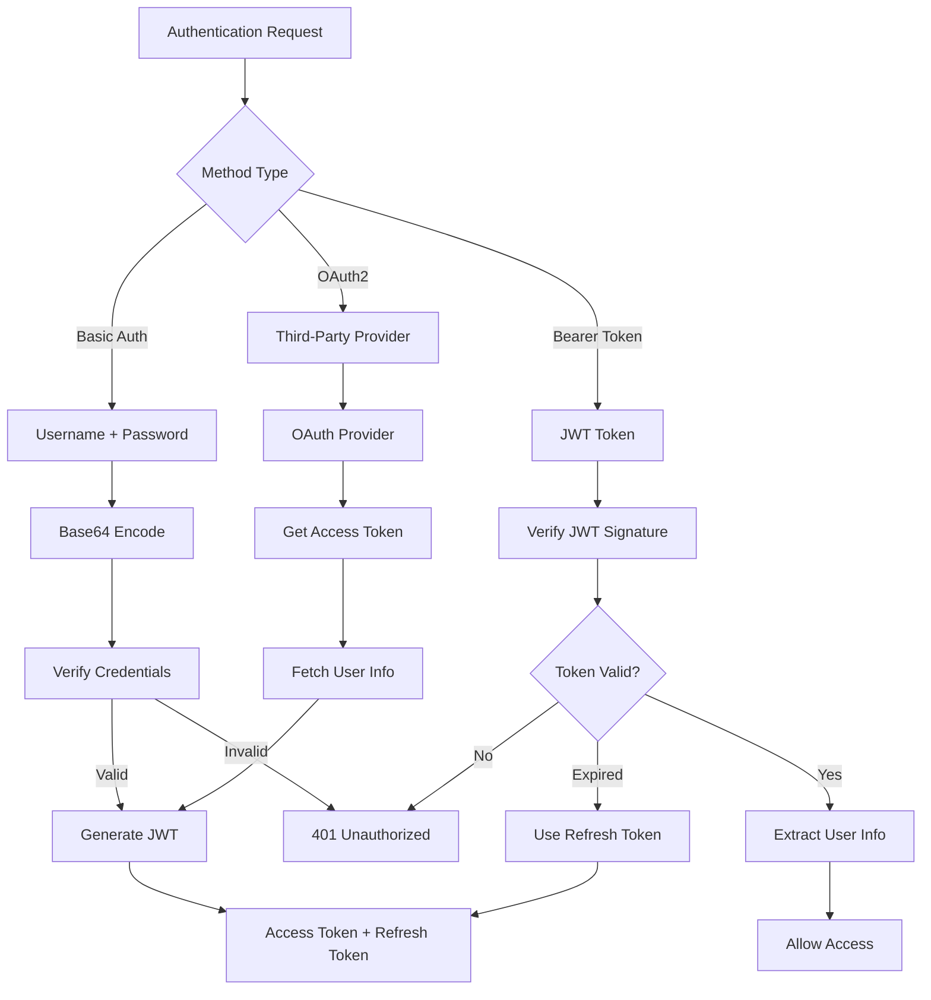

### Authentication Comparison

<table>
  <thead>
    <tr>
      <th>Method</th>
      <th>Security</th>
      <th>Use Case</th>
      <th>Token Lifespan</th>
    </tr>
  </thead>
  <tbody>
    <tr>
      <td>**Basic Auth**</td>
      <td>Low (unless HTTPS)</td>
      <td>Internal tools, Legacy systems</td>
      <td>N/A (sent each time)</td>
    </tr>
    <tr>
      <td>**Bearer Token (JWT)**</td>
      <td>High</td>
      <td>Modern APIs, Microservices</td>
      <td>15-60 minutes</td>
    </tr>
    <tr>
      <td>**OAuth2**</td>
      <td>Very High</td>
      <td>Third-party login, Social auth</td>
      <td>Varies by provider</td>
    </tr>
    <tr>
      <td>**API Keys**</td>
      <td>Medium</td>
      <td>Server-to-server, Public APIs</td>
      <td>Long-lived</td>
    </tr>
  </tbody>
</table>

### JWT Token Structure

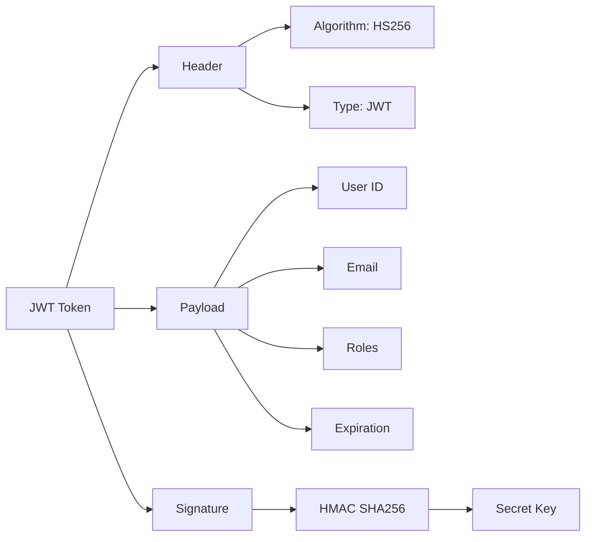

**Token Management Best Practices:**

1. **Access Tokens** (Short-lived: 15-60 min)
   - Used for API requests
   - Contains user claims
   - Stored in memory (not localStorage)

2. **Refresh Tokens** (Long-lived: 7-30 days)
   - Used to get new access tokens
   - Stored securely (httpOnly cookie)
   - Can be revoked
   - One-time use (rotate on refresh)

---

## Authorization Models

### Role-Based Access Control (RBAC)

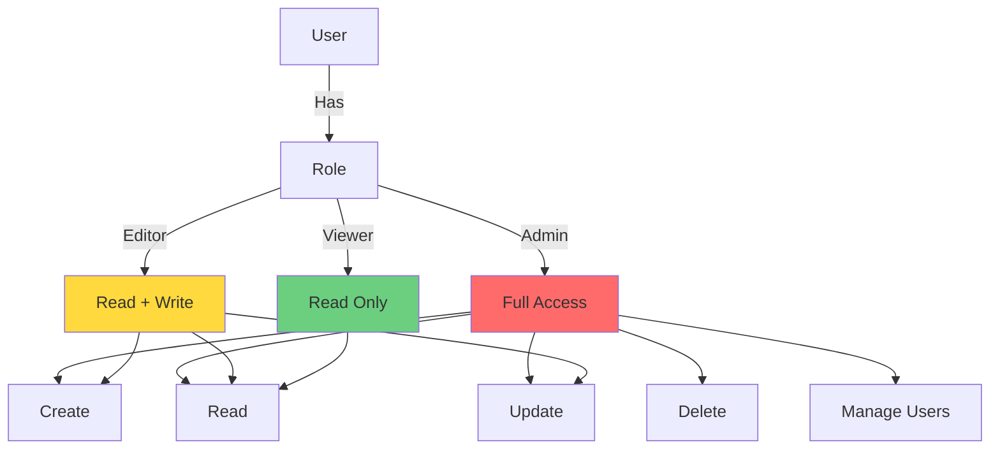

**Role Hierarchy Example:**

```
Admin (inherits all below)
  ├── Editor (inherits Viewer)
  │   └── Viewer
  └── Manager (inherits Editor)
      └── Editor
```

### Attribute-Based Access Control (ABAC)

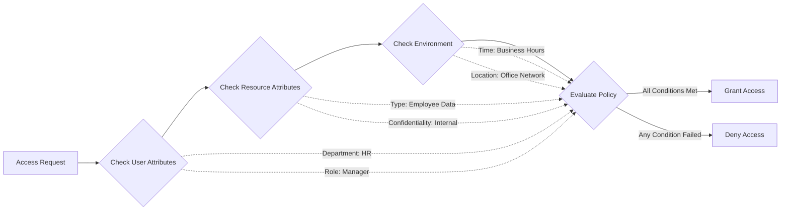

**ABAC Policy Examples:**

<table>
  <thead>
    <tr>
      <th>Policy</th>
      <th>Conditions</th>
      <th>Allowed Actions</th>
    </tr>
  </thead>
  <tbody>
    <tr>
      <td>HR Access</td>
      <td>`user.dept == "HR" AND resource.type == "employee"`</td>
      <td>Read, Update</td>
    </tr>
    <tr>
      <td>Manager Approval</td>
      <td>`user.role == "manager" AND resource.amount < $10,000`</td>
      <td>Approve, Reject</td>
    </tr>
    <tr>
      <td>Owner Access</td>
      <td>`resource.ownerId == user.id`</td>
      <td>Full Control</td>
    </tr>
    <tr>
      <td>Time-Based</td>
      <td>`currentTime BETWEEN 9am-5pm AND user.location == "office"`</td>
      <td>All Actions</td>
    </tr>
  </tbody>
</table>

### Access Control List (ACL)

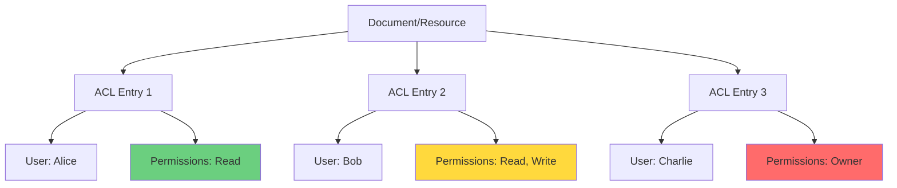

**Real-World Example: Google Drive**

When you share a document:
- **Viewer** - Can only read
- **Commenter** - Can read and comment
- **Editor** - Can read, write, and comment
- **Owner** - Full control + can delete

---

## RESTful API Design

### HTTP Methods & CRUD Operations

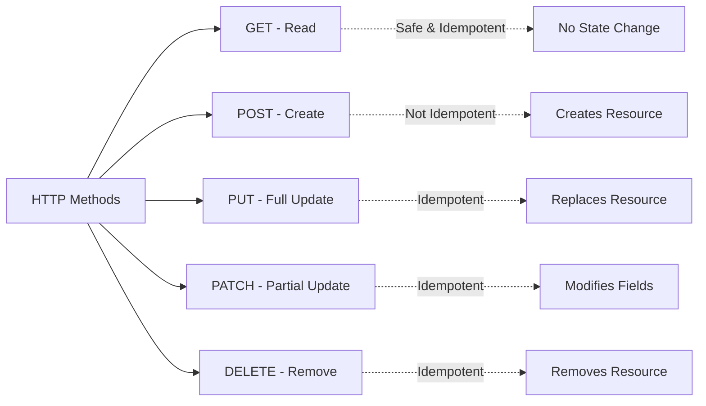

### RESTful Endpoint Design

**URL Structure Best Practices:**

```
✅ GOOD:
GET    /api/v1/products              # List all products
GET    /api/v1/products/123          # Get specific product
POST   /api/v1/products              # Create product
PUT    /api/v1/products/123          # Full update
PATCH  /api/v1/products/123          # Partial update
DELETE /api/v1/products/123          # Delete product
GET    /api/v1/products/123/reviews  # Nested resources

❌ BAD:
GET    /api/v1/getProducts           # Don't use verbs
POST   /api/v1/product               # Use plural nouns
GET    /api/v1/products/delete/123   # Use DELETE method
```

### Query Parameters for Filtering, Sorting & Pagination

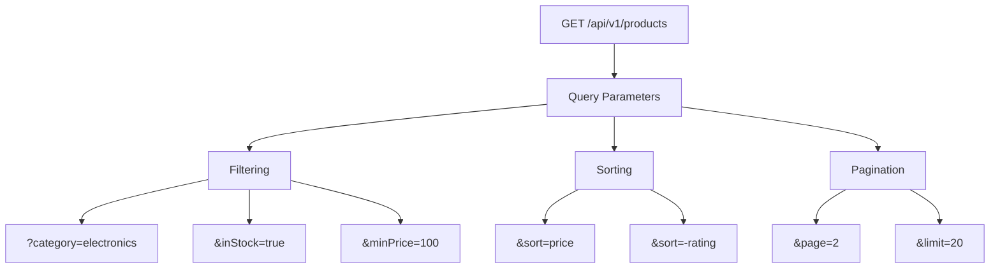

**Complete Example:**
```
GET /api/v1/products?category=electronics&inStock=true&sort=-rating&page=1&limit=20

Returns:
- Electronics products
- Only in stock
- Sorted by rating (descending)
- Page 1 with 20 items per page
```

### HTTP Status Codes

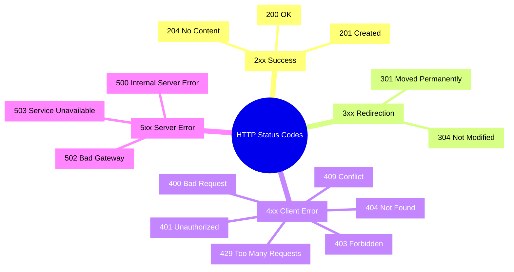

**When to Use Each Status Code:**

<table>
  <thead>
    <tr>
      <th>Code</th>
      <th>Use Case</th>
      <th>Example</th>
    </tr>
  </thead>
  <tbody>
    <tr>
      <td>200</td>
      <td>Successful GET, PUT, PATCH</td>
      <td>Retrieved user data</td>
    </tr>
    <tr>
      <td>201</td>
      <td>Resource created</td>
      <td>New product added</td>
    </tr>
    <tr>
      <td>204</td>
      <td>Successful DELETE</td>
      <td>Product removed</td>
    </tr>
    <tr>
      <td>400</td>
      <td>Invalid request format</td>
      <td>Missing required field</td>
    </tr>
    <tr>
      <td>401</td>
      <td>Authentication failed</td>
      <td>Invalid token</td>
    </tr>
    <tr>
      <td>403</td>
      <td>Insufficient permissions</td>
      <td>Not admin</td>
    </tr>
    <tr>
      <td>404</td>
      <td>Resource not found</td>
      <td>Product doesn't exist</td>
    </tr>
    <tr>
      <td>409</td>
      <td>Conflict</td>
      <td>Duplicate email</td>
    </tr>
    <tr>
      <td>429</td>
      <td>Rate limit exceeded</td>
      <td>Too many requests</td>
    </tr>
    <tr>
      <td>500</td>
      <td>Server error</td>
      <td>Database connection failed</td>
    </tr>
  </tbody>
</table>

---

### Response Format

**Consistent JSON Structure:**

```json
// Success Response
{
  "success": true,
  "timestamp": "2024-01-15T10:30:00Z",
  "data": {
    "id": "123",
    "name": "Product Name"
  },
  "pagination": {
    "page": 1,
    "limit": 20,
    "total": 100,
    "totalPages": 5
  }
}

// Error Response
{
  "success": false,
  "timestamp": "2024-01-15T10:30:00Z",
  "error": "Resource not found",
  "code": "PRODUCT_NOT_FOUND",
  "details": [
    {
      "field": "productId",
      "message": "Product with ID 123 does not exist"
    }
  ],
  "requestId": "req_abc123"
}
```

---

## API Versioning Strategy

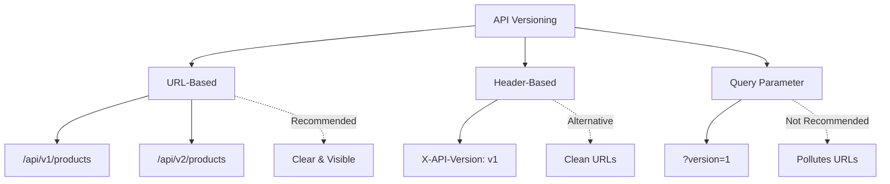

**Versioning Best Practices:**

1. **When to Create New Version:**
   - Breaking changes in response structure
   - Removing endpoints or fields
   - Changing authentication methods

2. **When NOT to Create New Version:**
   - Adding optional fields
   - Adding new endpoints
   - Performance improvements
   - Bug fixes

3. **Version Lifecycle:**
   - **Active**: Current version, full support
   - **Deprecated**: Old version, security updates only
   - **Retired**: No longer available

---

## Caching Strategy

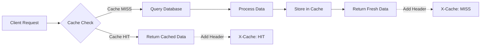

**Cache Configuration by Endpoint:**

<table>
  <thead>
    <tr>
      <th>Endpoint</th>
      <th>Cache Duration</th>
      <th>Strategy</th>
      <th>Invalidation</th>
    </tr>
  </thead>
  <tbody>
    <tr>
      <td>`/products`</td>
      <td>5 minutes</td>
      <td>Time-based</td>
      <td>On product update</td>
    </tr>
    <tr>
      <td>`/products/:id`</td>
      <td>10 minutes</td>
      <td>Time-based</td>
      <td>On specific product update</td>
    </tr>
    <tr>
      <td>`/user/profile`</td>
      <td>No cache</td>
      <td>-</td>
      <td>Real-time data</td>
    </tr>
    <tr>
      <td>`/static/images`</td>
      <td>1 year</td>
      <td>Long-term</td>
      <td>Version in URL</td>
    </tr>
  </tbody>
</table>

**Cache Headers:**
```http
Cache-Control: public, max-age=300        # 5 minutes
ETag: "abc123"                            # Version identifier
Last-Modified: Wed, 15 Jan 2024 10:30:00 # Last update time
```

---

## Complete API Flow Example

### E-Commerce Product Purchase Flow

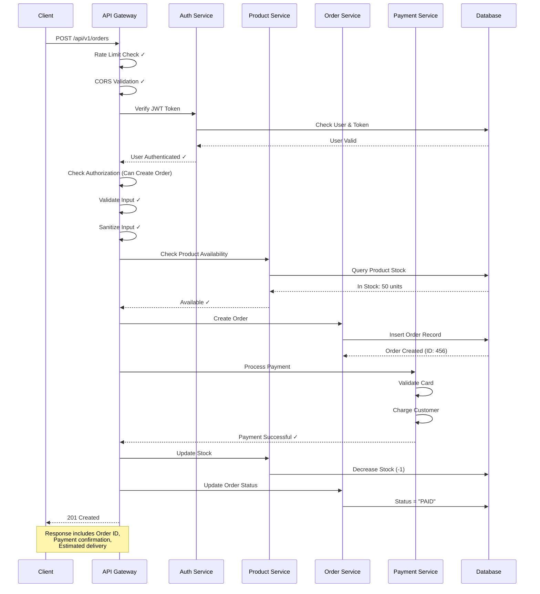

---

## Best Practices Checklist

### 🔒 Security Checklist

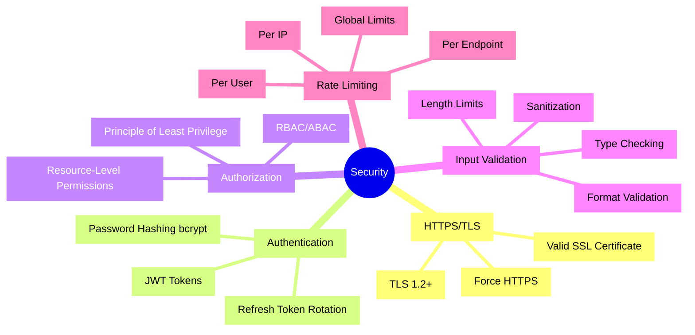

**Pre-Deployment Security Checklist:**

- [ ] All endpoints use HTTPS
- [ ] JWT tokens expire within 1 hour
- [ ] Refresh tokens rotate on use
- [ ] Passwords hashed with bcrypt (10+ rounds)
- [ ] All inputs validated and sanitized
- [ ] SQL injection protection (parameterized queries)
- [ ] XSS prevention (HTML encoding)
- [ ] CSRF tokens on state-changing operations
- [ ] Rate limiting on all endpoints
- [ ] CORS configured for specific origins
- [ ] Security headers set (CSP, X-Frame-Options, etc.)
- [ ] Sensitive data not logged
- [ ] Error messages don't leak system info

### 📊 Performance Checklist

- [ ] Database indexes on frequently queried fields
- [ ] Pagination on list endpoints (max 100 items)
- [ ] Caching strategy implemented
- [ ] Connection pooling configured
- [ ] Compression enabled (gzip)
- [ ] CDN for static assets
- [ ] Query optimization (N+1 prevention)
- [ ] Background jobs for heavy operations
- [ ] Load balancing configured

### 📝 API Design Checklist

- [ ] RESTful URL conventions (plural nouns)
- [ ] Consistent naming (camelCase or snake_case)
- [ ] Proper HTTP methods used
- [ ] Appropriate status codes returned
- [ ] Filtering, sorting, pagination supported
- [ ] API versioning in place
- [ ] Consistent error response format
- [ ] API documentation (Swagger/OpenAPI)
- [ ] Backward compatibility maintained

### 🔍 Monitoring & Logging

- [ ] Request/response logging
- [ ] Error tracking (e.g., Sentry)
- [ ] Performance monitoring (APM)
- [ ] Health check endpoint (`/health`)
- [ ] Metrics endpoint (`/metrics`)
- [ ] Audit logs for sensitive operations
- [ ] Alert system for critical errors

---

## Quick Reference: Common Patterns

### Authentication Pattern
```
1. User sends credentials → API
2. API validates credentials → Database
3. API generates JWT + Refresh Token
4. Client stores tokens
5. Client sends JWT with each request
6. API validates JWT
7. When JWT expires, use refresh token to get new JWT
```

### Authorization Pattern
```
1. Extract user from JWT
2. Check user role/permissions
3. Check resource ownership (if applicable)
4. Evaluate access policies (RBAC/ABAC)
5. Allow or deny request
```

### Error Handling Pattern
```
1. Catch error at appropriate level
2. Log error with context
3. Determine error type
4. Map to appropriate HTTP status code
5. Return consistent error response
6. Don't expose sensitive details in production
```

### Cache Pattern
```
1. Generate cache key (route + params)
2. Check if cache exists
3. If hit: return cached data
4. If miss: query database
5. Store in cache with TTL
6. Invalidate cache on data update
```

---