import streamingSvg from '../../assets/blog_image/streaming.svg';

## Interview Question
**Design a video streaming platform like Netflix that can serve millions of users worldwide with high availability, low latency, and personalized content recommendations.**

---

## 1. Requirements Clarification

### Functional Requirements
- **Video Streaming**: Stream videos in multiple resolutions (480p, 720p, 1080p, 4K)
- **User Management**: User registration, authentication, profiles, subscriptions
- **Content Management**: Upload, store, and manage video content
- **Search & Discovery**: Search videos by title, genre, actors, etc.
- **Recommendations**: Personalized content suggestions based on viewing history
- **Watch History**: Track what users have watched and resume functionality
- **Multiple Profiles**: Support multiple user profiles per account
- **Offline Viewing**: Download videos for offline consumption
- **Social Features**: Ratings, reviews, watchlists

### Non-Functional Requirements
- **Scale**: 200M+ registered users, 50M+ concurrent users
- **Availability**: 99.99% uptime (52 minutes downtime per year)
- **Performance**: Video start time < 2 seconds, global latency < 100ms
- **Storage**: 10PB+ of video content
- **Bandwidth**: Handle 100+ Gbps of video traffic
- **Security**: Content protection, DRM, user data security
- **Consistency**: Eventual consistency for most operations, strong consistency for payments

---

## 2. Capacity Estimation

### User Statistics
- **Total Users**: 200M registered users
- **Active Users**: 50M daily active users
- **Concurrent Users**: 20M peak concurrent users
- **New Videos**: 1000 new videos uploaded daily
- **Watch Time**: 1 billion hours watched monthly

### Storage Requirements
- **Video Storage**: 10PB (average 5GB per video × 2M videos)
- **Metadata Storage**: 1TB (user data, video metadata)
- **Backup Storage**: 20PB (2x replication)

### Bandwidth Requirements
- **Peak Traffic**: 100+ Gbps
- **Average Bitrate**: 5 Mbps per stream
- **CDN Bandwidth**: 80% of traffic served from edge locations

---

## 3. System Architecture

---

## 4. Database Design

### 4.1 User Database (MySQL - Master-Slave)

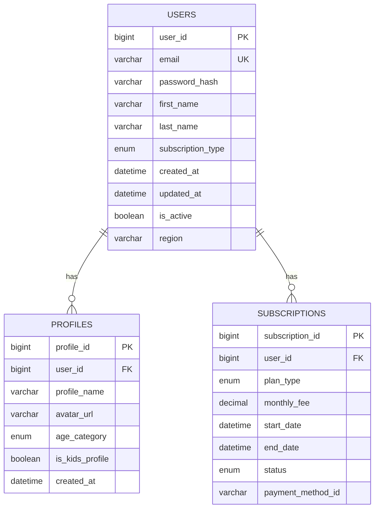

**Benefits:**
- **ACID Compliance**: Ensures data consistency for critical user operations
- **Mature Technology**: Well-established with extensive tooling and support
- **Strong Consistency**: Important for billing and subscription management
- **Replication**: Master-slave setup for read scalability

### 4.2 Content Database (MongoDB - Replica Set)

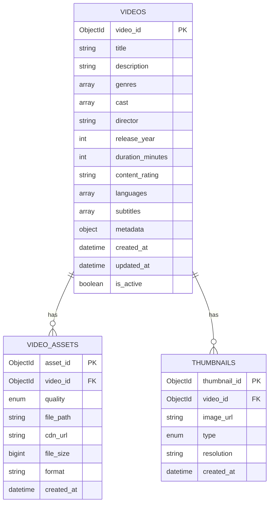

**Benefits:**
- **Flexible Schema**: Easy to add new fields without migrations
- **Horizontal Scaling**: Natural sharding capabilities
- **JSON Storage**: Perfect for metadata and complex nested data
- **Rich Indexing**: Supports complex queries on arrays and nested objects

### 4.3 Analytics Database (Apache Cassandra)

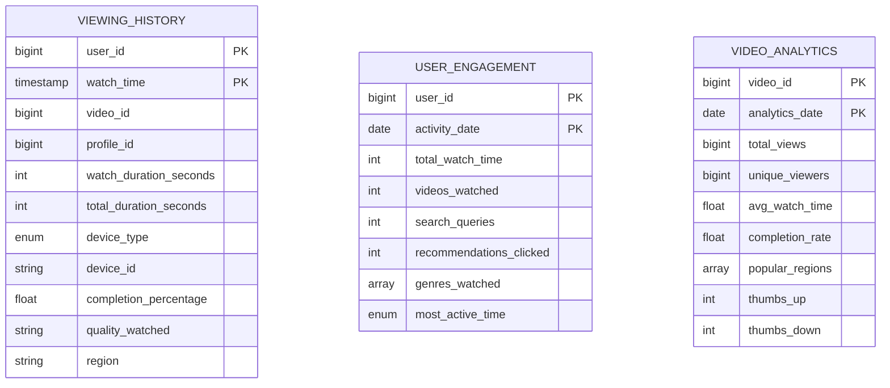

**Benefits:**
- **Time-Series Optimization**: Perfect for analytics and viewing history
- **High Write Throughput**: Handles billions of events per day
- **Eventual Consistency**: Acceptable for analytics use cases
- **Partition Tolerance**: Distributed across multiple data centers

### 4.4 Search Index (Elasticsearch)

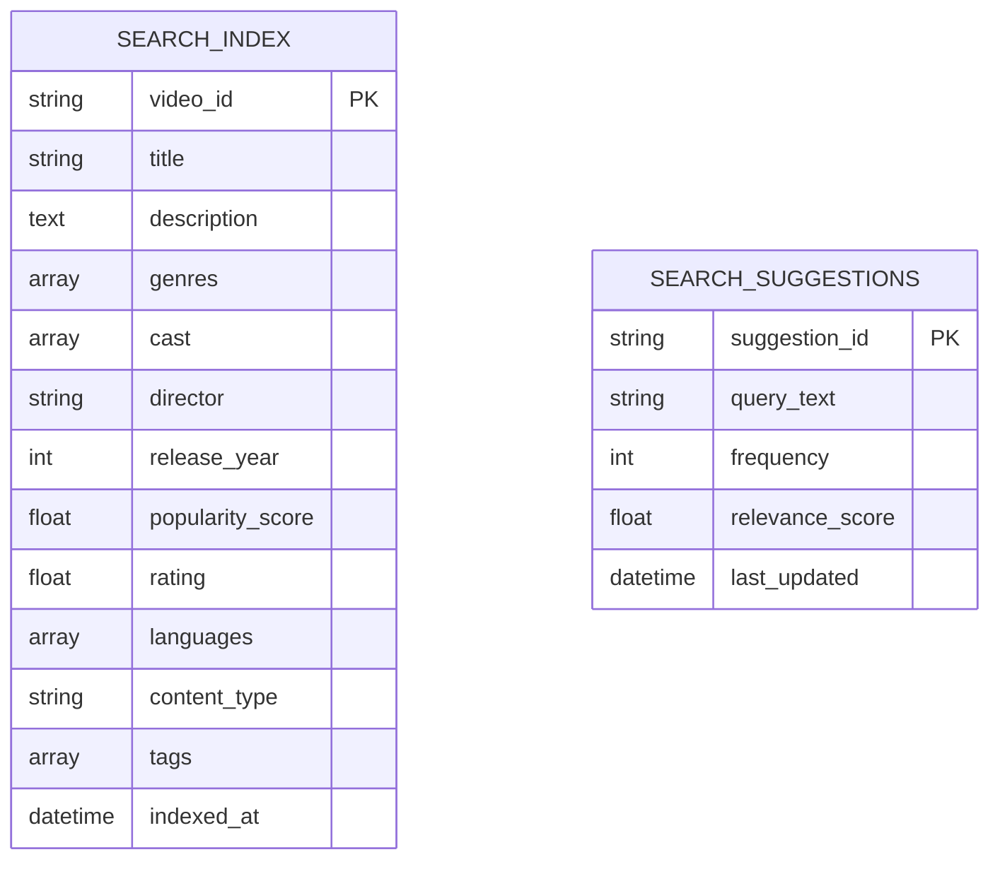

**Benefits:**
- **Full-Text Search**: Advanced search capabilities with ranking
- **Real-Time Indexing**: Near real-time search results
- **Faceted Search**: Filter by genre, year, rating, etc.
- **Autocomplete**: Fast suggestion generation

---

## 5. Key Features & Benefits

### 5.1 Content Delivery Network (CDN)

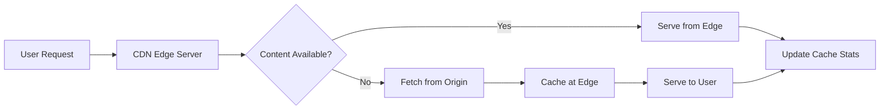

**Benefits:**
- **Low Latency**: Content served from nearest edge server
- **Bandwidth Optimization**: Reduces origin server load by 80%
- **Global Scale**: 15,000+ edge servers worldwide
- **Cost Reduction**: Lower data transfer costs

### 5.2 Video Processing Pipeline

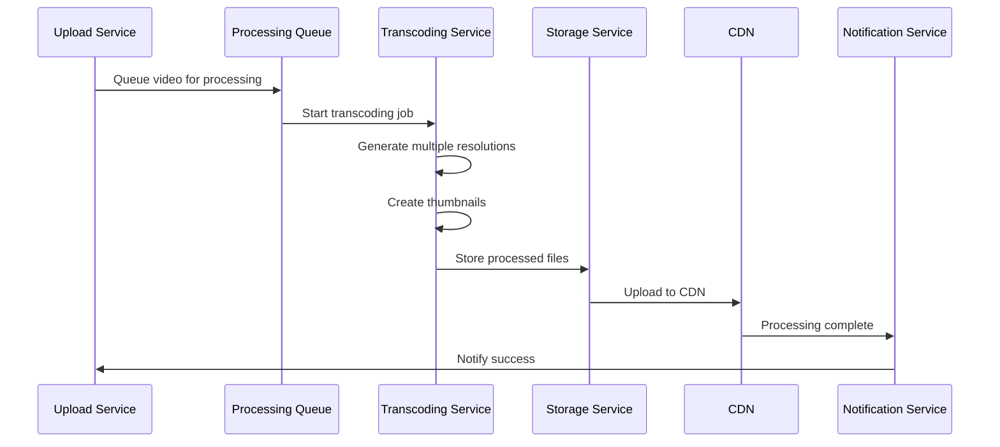

**Benefits:**
- **Multiple Quality Options**: 480p, 720p, 1080p, 4K support
- **Adaptive Bitrate**: Automatically adjusts quality based on network
- **Parallel Processing**: Multiple transcoding jobs simultaneously
- **Thumbnail Generation**: Multiple thumbnail options for better UX

### 5.3 Recommendation System

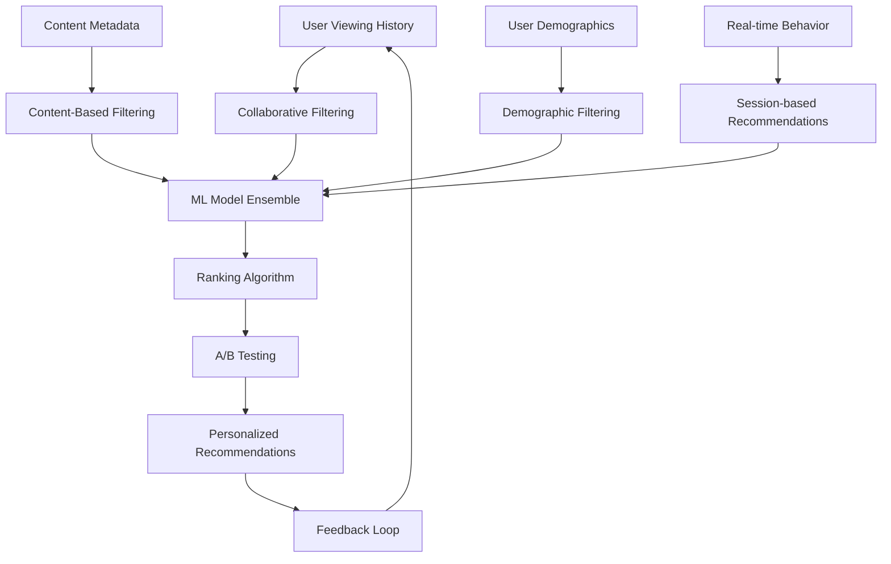

**Benefits:**
- **Personalization**: Improves user engagement by 35%
- **Discovery**: Helps users find new content
- **Retention**: Increases watch time and reduces churn
- **Revenue**: Drives subscription renewals and upgrades

### 5.4 Microservices Architecture

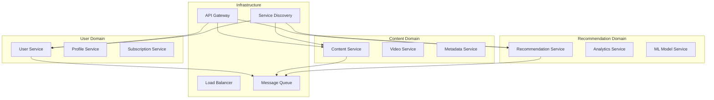

**Benefits:**
- **Scalability**: Scale individual services based on demand
- **Fault Isolation**: Failure in one service doesn't affect others
- **Technology Diversity**: Use best technology for each service
- **Team Autonomy**: Independent development and deployment

---

## 6. Performance Optimizations

### 6.1 Caching Strategy

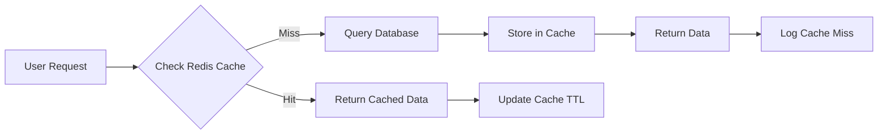

**Cache Layers:**
- **CDN Cache**: Video content (TTL: 7 days)
- **Redis Cache**: User sessions, metadata (TTL: 1 hour)
- **Application Cache**: Search results, recommendations (TTL: 15 minutes)
- **Database Cache**: Query result caching

### 6.2 Database Optimization

**Sharding Strategy:**
- **User Database**: Shard by user_id (consistent hashing)
- **Content Database**: Shard by video_id or region
- **Analytics Database**: Partition by time + user_id

**Read Replicas:**
- **User Service**: 3 read replicas per region
- **Content Service**: 5 read replicas globally
- **Analytics**: Read-only replicas for reporting

---

## 7. Security & Compliance

### 7.1 Content Protection (DRM)

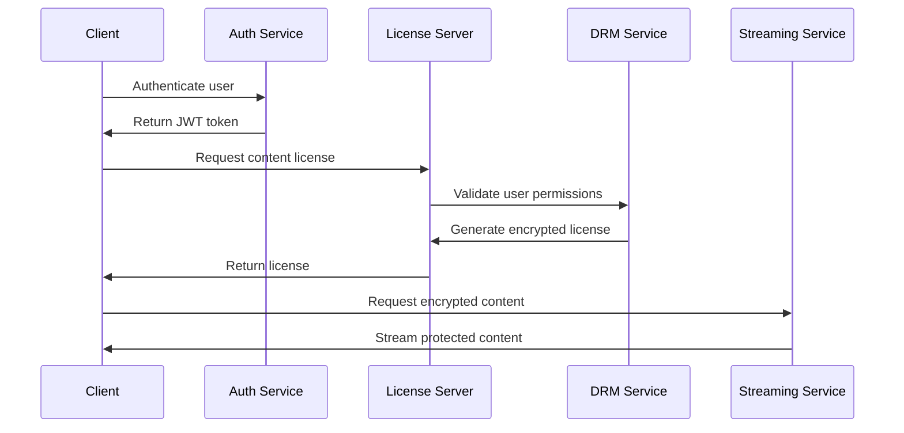

**Benefits:**
- **Content Protection**: Prevents unauthorized copying
- **Geo-blocking**: Enforce regional content licensing
- **Device Limitation**: Control playback on registered devices
- **Compliance**: Meet content provider requirements

### 7.2 Security Measures

- **Authentication**: OAuth 2.0 with JWT tokens
- **Authorization**: Role-based access control (RBAC)
- **Encryption**: TLS 1.3 for data in transit, AES-256 for data at rest
- **API Security**: Rate limiting, input validation, SQL injection prevention
- **Monitoring**: Real-time threat detection and response

---

## 8. Monitoring & Observability

### 8.1 Key Metrics

**System Metrics:**
- **Response Time**: 95th percentile < 100ms
- **Throughput**: Requests per second
- **Error Rate**: < 0.1% error rate
- **Availability**: 99.99% uptime

**Business Metrics:**
- **User Engagement**: Daily/Monthly active users
- **Content Performance**: View counts, completion rates
- **Revenue**: Subscription conversions, churn rate
- **Quality**: Video start failures, buffering events

### 8.2 Alerting Strategy

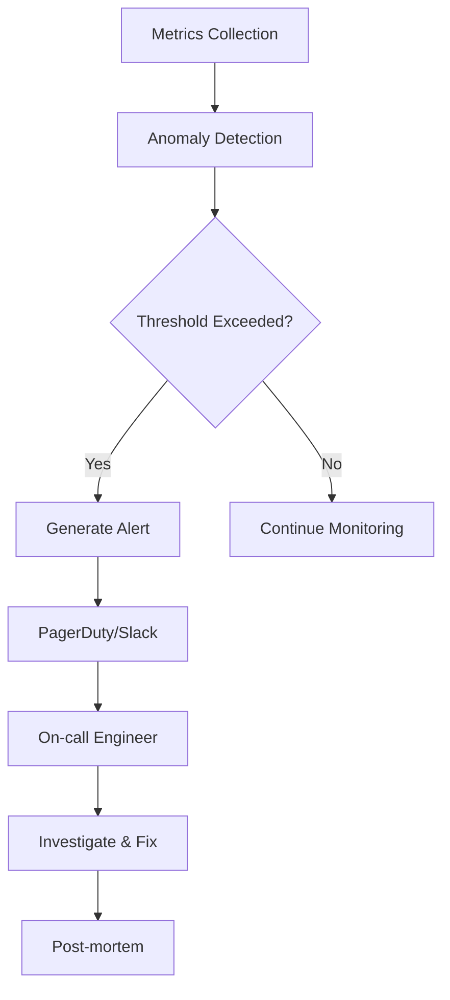

---

## 9. Scalability & Future Considerations

### 9.1 Auto-scaling Strategy

- **Horizontal Scaling**: Kubernetes with HPA (Horizontal Pod Autoscaler)
- **Database Scaling**: Read replicas, sharding, connection pooling
- **CDN Scaling**: Dynamic edge server provisioning
- **Cost Optimization**: Reserved instances, spot instances for batch processing

### 9.2 Future Enhancements

- **AI-Powered Features**: Content generation, automated subtitles
- **Interactive Content**: Choose-your-own-adventure videos
- **Live Streaming**: Real-time sports and events
- **Mobile-First**: Optimized for mobile viewing patterns
- **Edge Computing**: Processing at edge locations

---

## 10. Interview Discussion Points

### Trade-offs Made:
1. **Consistency vs Availability**: Chose eventual consistency for analytics
2. **Cost vs Performance**: CDN costs vs user experience
3. **Complexity vs Maintainability**: Microservices vs monolithic architecture

### Bottlenecks Identified:
1. **Video Processing**: CPU-intensive transcoding operations
2. **Database Queries**: Complex recommendation queries
3. **Network Bandwidth**: Peak traffic handling

### Scaling Strategies:
1. **Vertical Scaling**: Upgrade hardware for immediate relief
2. **Horizontal Scaling**: Add more servers for long-term growth
3. **Caching**: Reduce database load through intelligent caching
4. **CDN**: Distribute content globally for better performance

